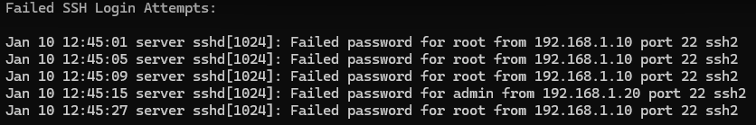
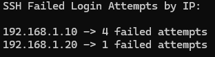

# Linux Log Analysis & SIEM Detection Lab

---

## Overview
This project demonstrates automated Linux log monitoring and threat detection using Python.  
The system parses Linux authentication logs and identifies suspicious activity such as SSH brute force attacks.

Detected security events can be analyzed and visualized in a SIEM-style dashboard environment.

---

## System Architecture
```
Linux Logs (/var/log/auth.log)
        ↓
Log Parser (Python)
        ↓
Detection Rules
        ↓
Alert Generation
        ↓
SIEM Dashboard
```
---

## Project Structure

parsers/        - Log parsing scripts  
detections/     - Security detection rules  
scripts/        - Automation and monitoring scripts  
sample_logs/    - Example Linux log files for testing  
dashboards/     - SIEM dashboard configurations  
docs/           - Project documentation and attack simulations  
screenshots/    - Dashboard and detection screenshots  

---

## Skills Demonstrated

- Linux log analysis
- Security detection engineering
- Threat monitoring automation
- Python scripting
- SIEM concepts
- Security event investigation

---

## Detection Use Cases

### Raw Failed SSH Login Attempts

Example authentication log entries showing repeated failed login attempts.



### IP-Based Detection Output

After parsing the logs, the system counts failed login attempts per attacker IP.



### SSH Brute Force Detection

Detects potential SSH brute-force attacks when a single IP address exceeds a defined threshold of failed login attempts.

**Log Source**
```
/var/log/auth.log
```

**Detection Logic**
### Example Detection Output

⚠ ALERT: Possible SSH brute force attack detected  
IP: 192.168.1.10  
Failed Attempts: 4


- Monitor failed login attempts
- Count attempts per IP address
- Trigger alert when attempts exceed a defined threshold

**Example Log Entry**
```
Failed password for root from 192.168.1.10 port 22 ssh2
```

---

## MITRE ATT&CK Mapping

| Detection | Technique | ID |
|----------|-----------|----|
| SSH Brute Force | Brute Force | T1110 |
| Unauthorized Login Attempts | Valid Accounts | T1078 |

---

## Attack Simulation

To test detection rules, SSH login attempts can be simulated.

Example command:
```
ssh wronguser@localhost
```

Repeated login failures generate entries in:
/var/log/auth.log

These entries are analyzed by the detection scripts.

Full simulation documentation:
docs/attack_simulation.md

---

## Example Logs

Sample authentication logs are stored in:
```
sample_logs/auth_sample.log
```

These logs allow testing detection scripts without requiring a live system.

---

## Future Improvements

- Real-time log monitoring
- Elasticsearch and Kibana SIEM integration
- Additional detection rules (sudo abuse, privilege escalation)
- Automated alerting system
- Threat intelligence enrichment
- Log correlation across multiple systems

---

## License

This project is licensed under the MIT License.
